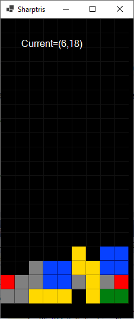

# Sharptris
Sharptris is an implementation of the famous game Tetris in .NET. 
It is an exercise to use modern .NET 5 technology to implement it. Currently it uses Windows Form as UI and System.Drawing as rendering technology.
The objective behind this is the implementation of a tile-based framework to implements '80 style games.
## 2021.01.07
- The game is playable with movements, line completion, but does not track any score or finish recognition.

- It is in 1:1 scale: zoom will be implemented soon
- a bug: sometime a tetromino hangs because you are moving horizontally but have space to go down (there is an error in priority of stop conditions)
- I have to improve keyboard management: I have saved key repeat (so you don't loose control), but at the moment the key does not repeat (and it is useful taking down tetromino)